# 7.2.8. Testing The Hello World Exercise

**Writing tests before you code** will enable you to **think through the goals** of **your code** and **validate** that it **works**. In this video, you will learn about the **test driven development workflow**, which will help you **refine your code**. To complete the **Hello World Exercise**, ```fork``` the **starter code** from this [GitHub repository](https://github.com/kogsio/greeting). Follow along with this video to **set this up** on your **local machine** and to **begin testing** with ```npm.```

Testing software, given its complexity, has been part of creating software for a very long time, well over 40 years. And as you start to write code and your code grows, keeping a handle on what's taking place, keeping some certainty about what's happening within your code is something that you want to have. Because of it, testing suites and testing ecosystems have emerged around the practice of building software. And one of the approaches is to write your software even before you start to write your code; it gives you some sense of where you're going. It gives you some feedback even before you start writing your code.

Now, as you get started, this might be too much to have a handle on as you're trying to master a lot of the different technologies. However, as your code matured and time passes, this is something you want to come back to. In this approach that you're seeing before you, it's test-driven development.

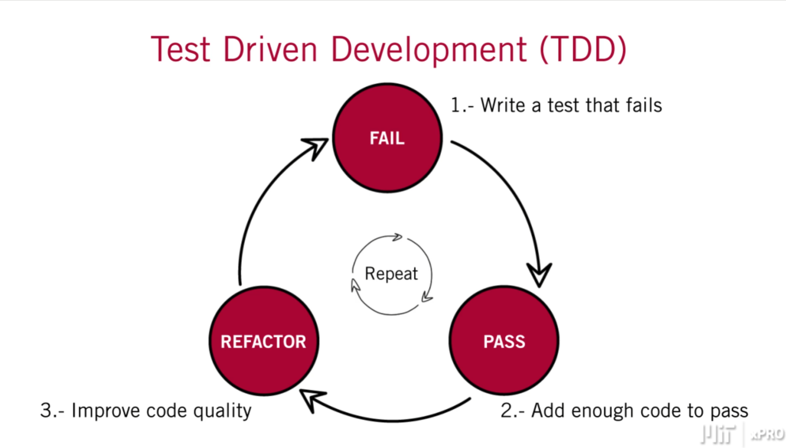

In this approach, you write your tests even before you start to write your code. And the approach would be to write some test that would initially would fail. Then you will write some minimal code that would allow you to pass the test. And then you would refactor, you would improve your code, and you will continue to do this until you had pretty good code that captured the intent that you were trying to represent in code.

So, if we take a look at a **number of steps**, you would think about the following. You would **write a test**; you would **watch it fail**. You would **write some more code**; initially, **it would fail** for a **few iterations**, then you would **fix it**. It would **eventually pass**, and **to the point** that **you felt good**. And then you would ```add```, ```commit```, and ```push``` into your **GitHub repository**.

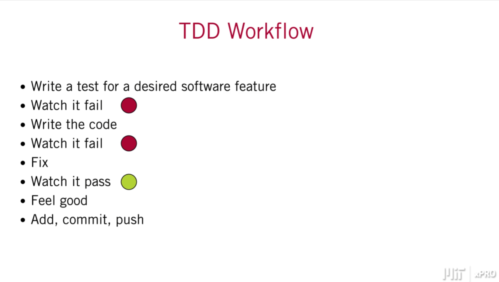

So, we've given you here a small ```"Hello, World!"``` **testing repository**. And what you're going to do is that you're going to ```fork```, you're going to **make a copy** on to your **own environment** within ```GitHub```. Then you're going to ```clone```, **make a copy** onto your **local environment**. Then you're going to **do your work**. And **once you're done**, you're going to ```push``` your **changes back up**.

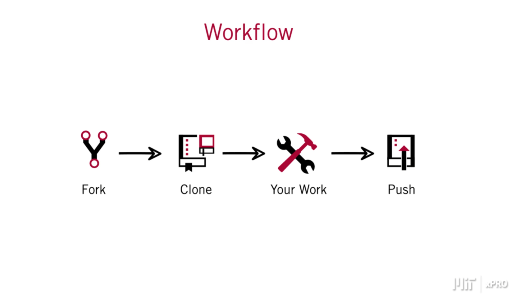

So, in a more **graphical representation** of that **workflow**. We're going to go to ```GitHub```. We're going to then **make a copy** on to our **local environment**, as you see here. Then we're **going to work** in a **decentralized**, **remote way**, that means we're going to **work locally**. And then **once we're done**, and we have **added our changes**, we're going to go ahead and **push those changes** back into ```GitHub```.

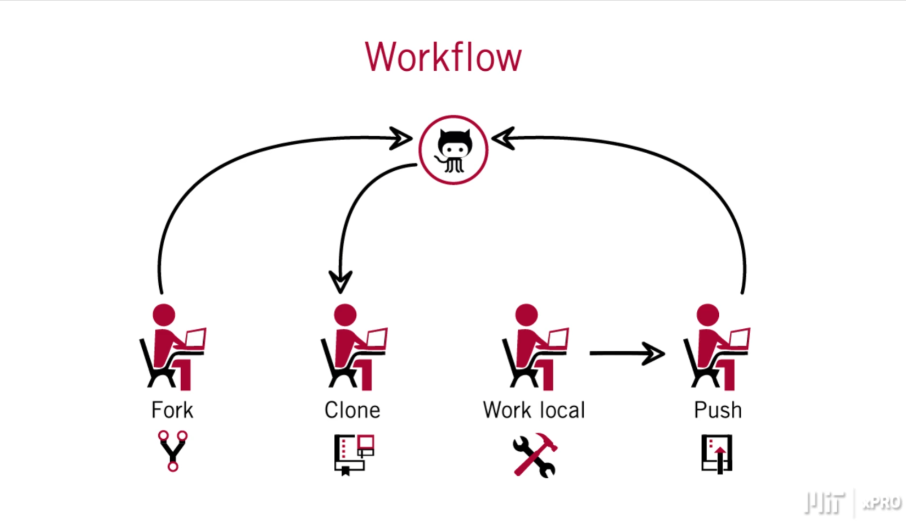

So, we'll start off by **navigating onto** a **repository** that we have **created for you**, and the address is https://github.com/kogsio/greeting.

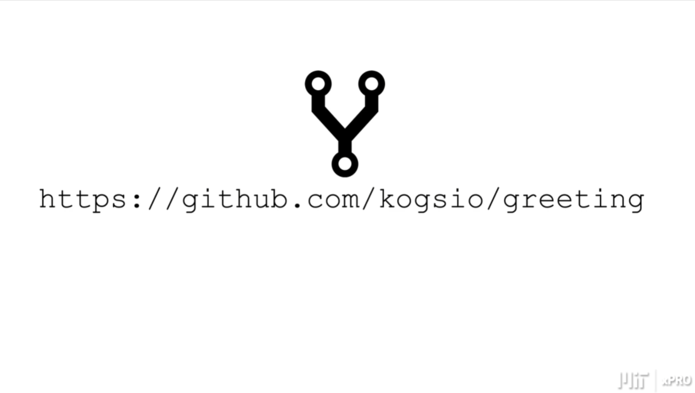

Now, as you can see here, **I am at an account**, and **this account** happens to belong to **Peter Parker**. This is meant to be a **learner's account**, and this person, ```Peter Parker```, is going to **navigate** to the **repository** that we just **showed the address** for. And he's going to go ahead and **make a fork** of that **repository**.

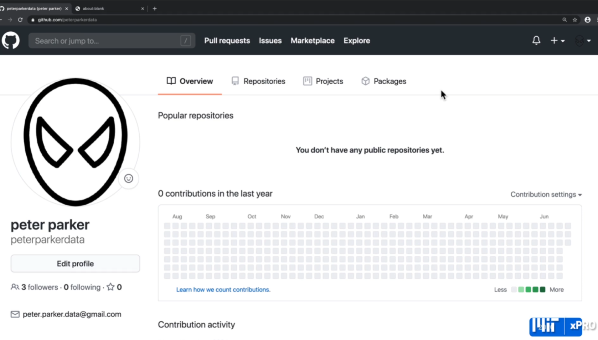

So, I'm going to go ahead and paste the address here, and I'm going to navigate. And you can see here that address for kogsio/greeting. And at this point, we're going to create a Fork, and we do that by pressing on the button here on the upper right-hand side. And you can see here in a moment that that Fork is being created. I am getting my own copy onto my own account; in this case, the account is Peter Parker. And you can see here that we have a small, a small indication of where that, where that repository came from. It says, forked from kogsio/greeting.

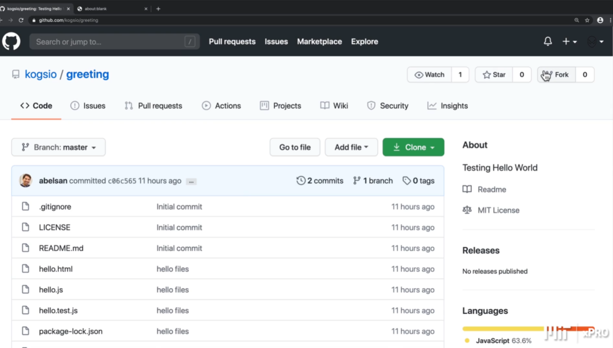

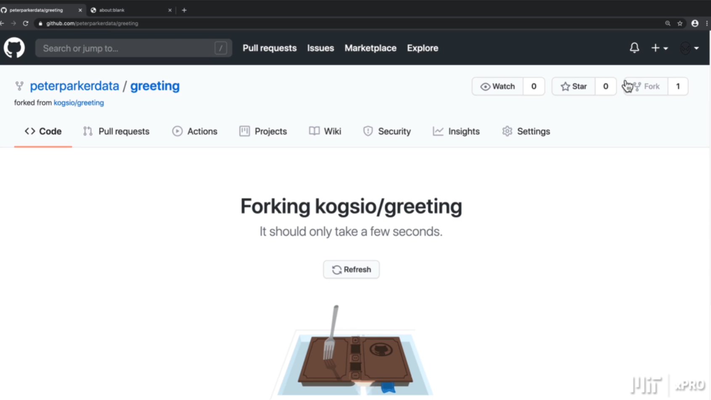

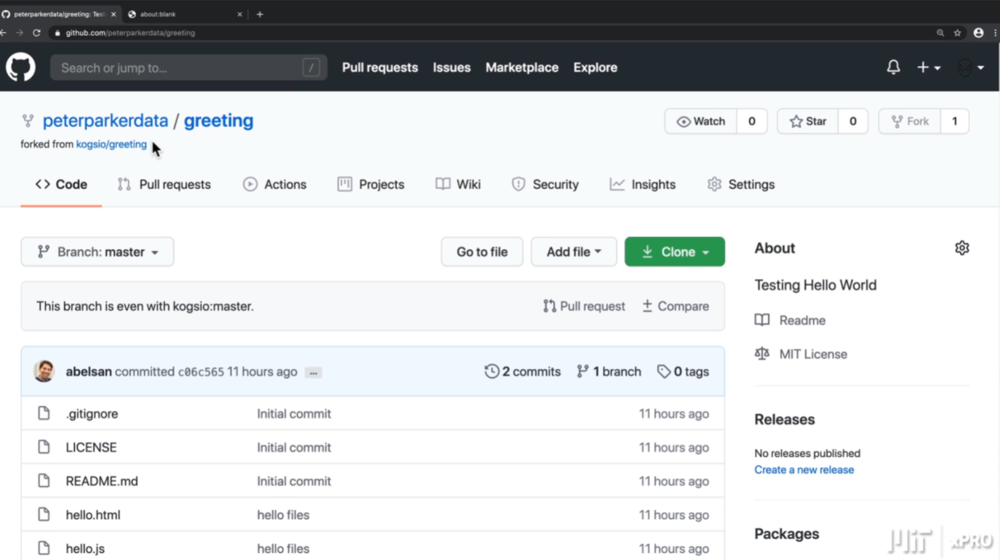

Next, we're going to go ahead and create a Clone, and we do that by pressing, clicking on the Clone button. And we're going to use, in this case, the SSH. So, we can set the permissions to be able to push back up. And you will only be able to do this for your own repository, your own account. And so, I'm going to go ahead and copy that.

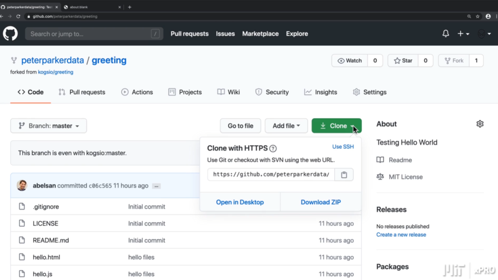

And as you can see now, I am at the Terminal, at the command line. And I'm going to go ahead and enter the command to clone that to my local machine. So, I enter 'git clone' plus the address that we got from GitHub, which is, you can see there the address it has 'git@github.com:peterparkerdata/greeting.git' So, I'm going to go ahead and clone. And as you can see that they are, that is made, that has been copied down onto my local machine.

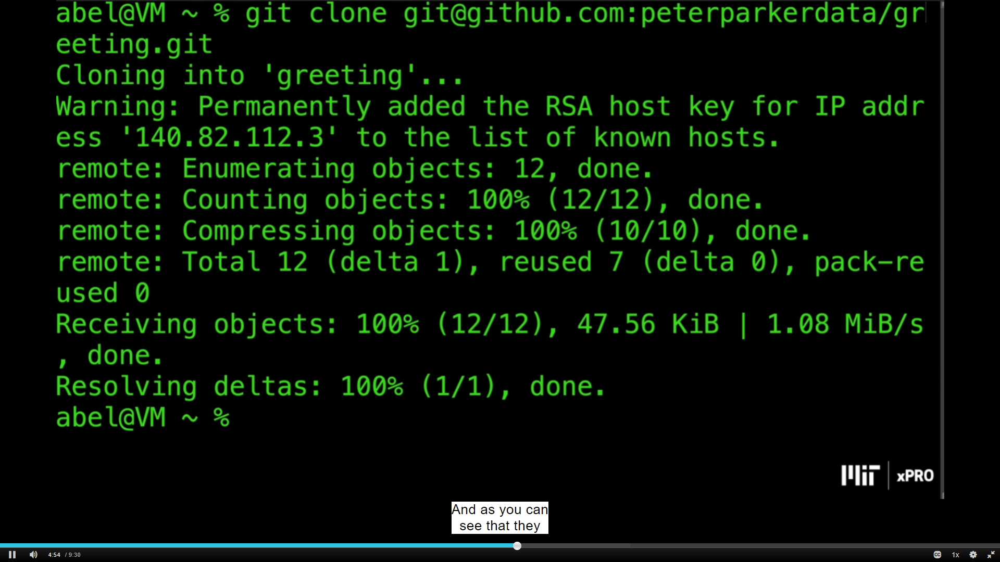

And now, I'm going to go ahead and move into that repository, which is called 'greeting'. And if I 'clear' my screen and I list my files, you'll see there that I have the same files that I had in GitHub. And let me go ahead and show you that. And as you can see there, as I scroll down the page, we have the same files. We have hello; we ```hello.js```, we have ```hello.task.js```.

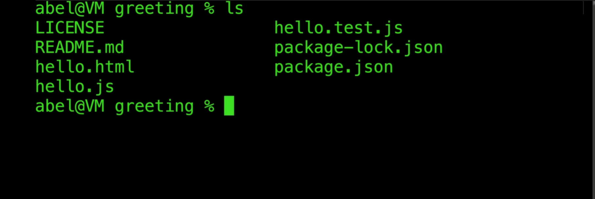

Next, we're going to **install all of the dependencies** that are **required** for us to **carry out our testing**, and we do that using ```npm```, which is **part of node**. And so, we will enter ```npm install```. And so, at this point, **we have everything that we need**. I'm going to go ahead and ```clear``` the screen.

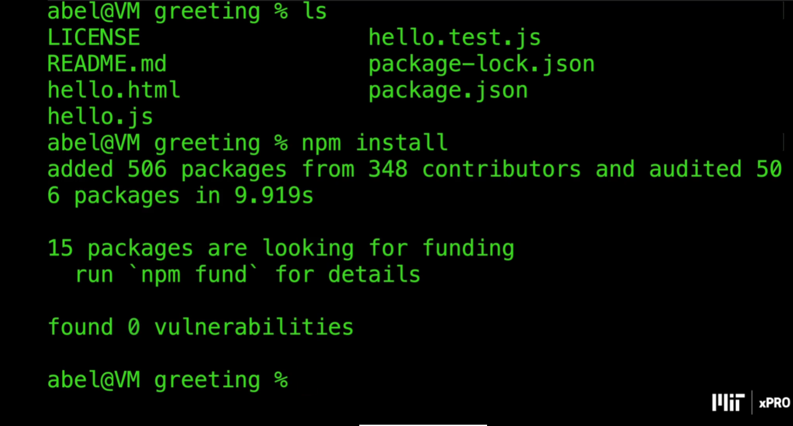

And I'm going to go ahead and **run the tests**. We **run it** by entering ```npm```. Once again, that is **part of node**, and in this case, we type ```npm test```. And I'm going to go ahead and **run that test now**. Now, as you can see there, that **test was successful**. I had one ```Test Suite```, which is a **grouping of test**. And inside of that ```Test Suite```, I had **only one test**, which is ```Tests```.

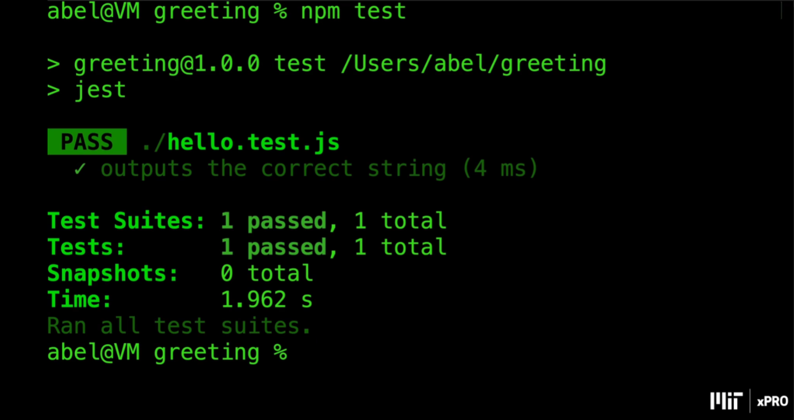

And so, let's go ahead and **take a look at the code**. As you can see here, I have **the editor** on my **left-hand side**. On the **right-hand side**, I have **the Console**, **the Terminal**, and I'm going to go ahead and **walk through the code**. On the **very first line**, I am **bringing in the file** `````"hello.js"`````. Then I have a **header**, ```HTML page```, and then a **little bit of script** that is **using** or **referencing a function** that we have within ```hello.js```. You'll see here **that it calls** a **function call** ```hello( );```, and then it **writes that response** to the **console**.

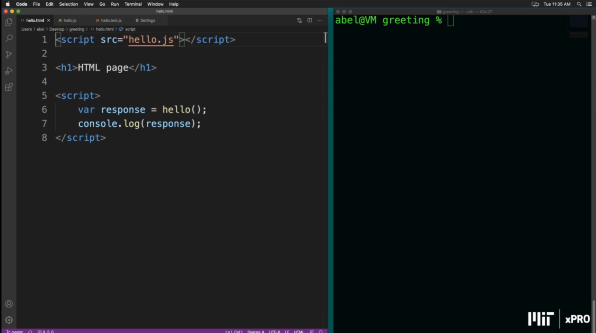

And if we **take a look** at the ```hello.js``` file, you'll see that it's a **simple function call** ```hello( )``` **that returns** ```"Hello World!"```.

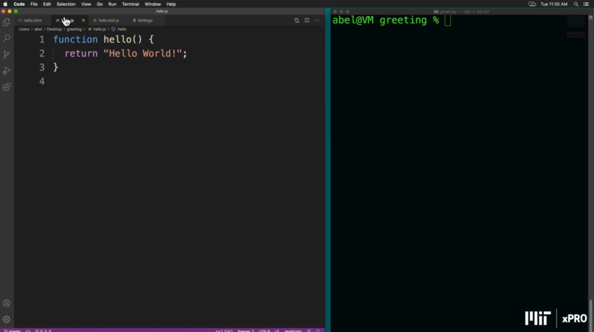

And if **we look at** our ```test```, **you can see** that the ```tests``` in this part here says, ```expect(hello( )).toBe("Hello World!");```. Now, this part, the ```hello.test.js``` file, **is part of** just a **testing framework** for **JavaScript** that we're using for **our code**. And you can see here also that there are **some other utilities**. We have something called ```course-utilities``` that **loads the code** that you then **reference here** on ```load``` and then **gives you access** to **those objects** or **those functions** within this **environment**.

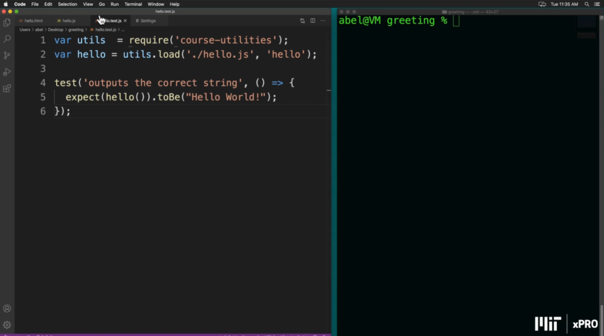

And so, you can see there that there is some language to learn when it comes to testing, but for now, let's go ahead and simply modify the code so that it's expecting to have ' "Hello World!" '. And if I remove the exclamation point there, saved it.

And then I'm going to go ahead and rerun the tests. You'll see that we get something different. You can see there that something failed. And if we scroll back up, you'll see here that it said expected ' "Hello World!" ' with an exclamation point, and we received ' "Hello World" ' without it. And so, it gives you there a good amount of information. In this case, we had a single task, and that was, that meant that the entire test failed.

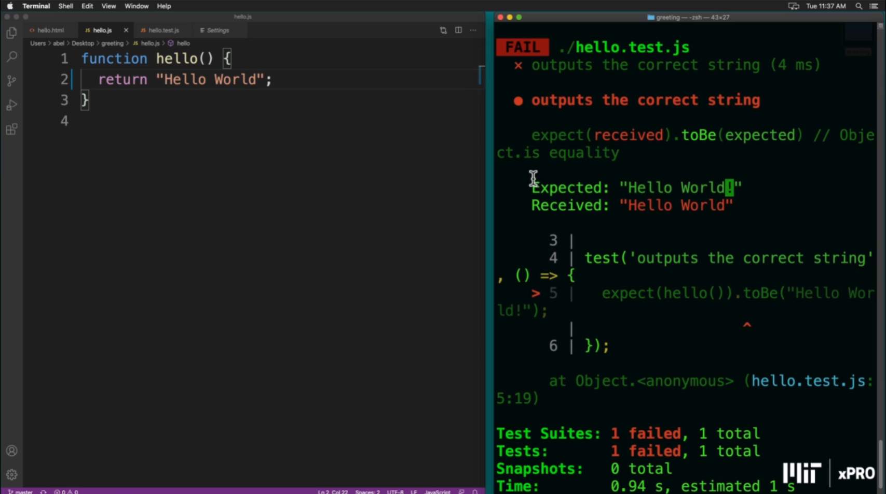

Normally, you had many more. So, I'm going to go ahead and add that exclamation point back in, save the file. And then I'm going to go ahead and rerun. And this time, as you can see, the tests pass. And it says here that one test that we were doing outputs the correct string is, in fact, correct.

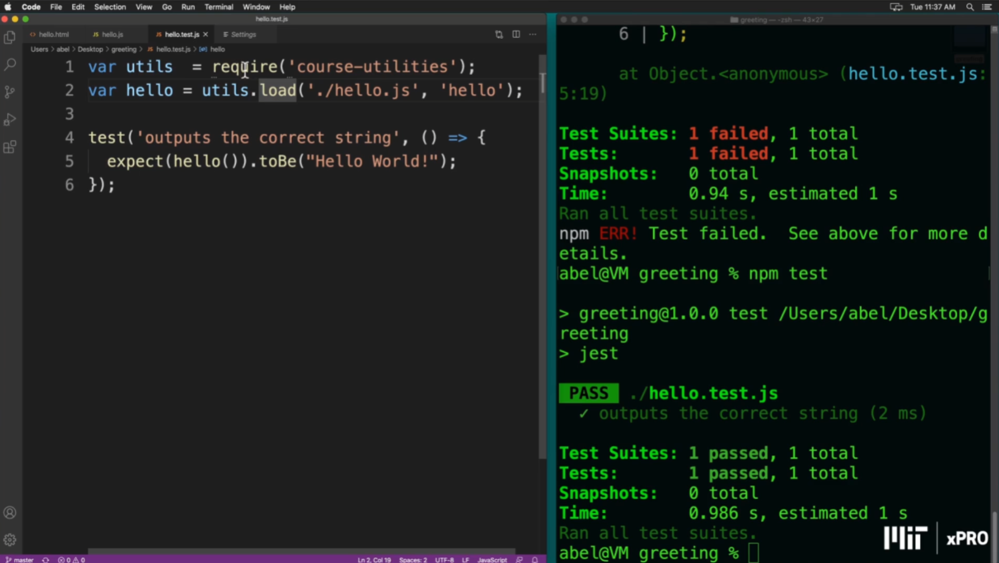

So, this is a minimal, a minimal test, a "Hello World!", where you are cloning, and you are checking to see that you have everything in place to be able to run the tests that you will use throughout the course.