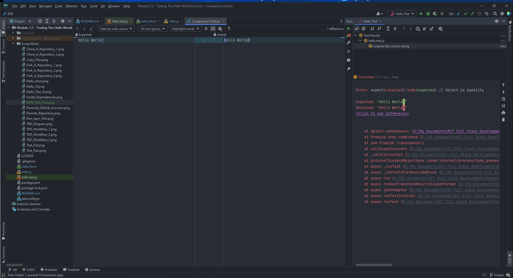
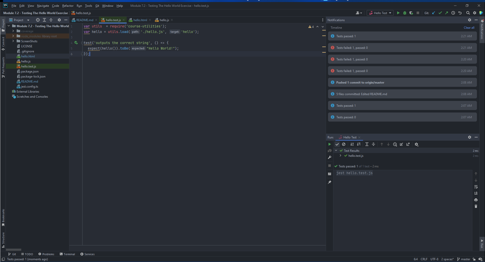
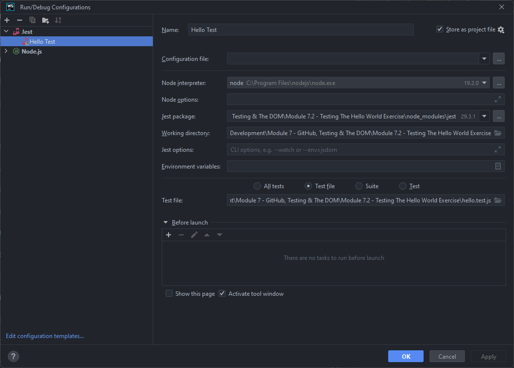
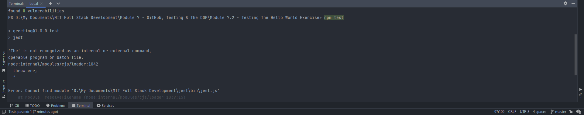
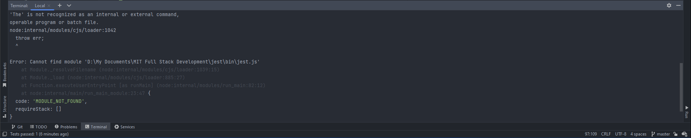
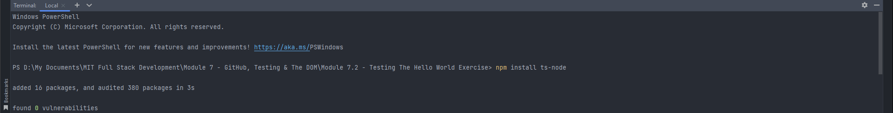

# 7.2.2. Testing on Jetbrains WebStorm.md

## I. Actual Output in WebStorm:

When Test Fails can click comparison



Change back to exclamation, and Test Passes



## II. Troubleshooting in WebStorm:

Need to use run button, doesn't work for some reason on terminal. But need to configure first as shown below.



Run ```npm install``` first.

Then run the following command ```npm test``` in the ```terminal``` but got the following error message. After spending 3 hours figuring out the only solution was to create a run config and run the test through the "green run button" and configuring it as shown above.





What fixed the ```error: 'no ts-node'``` error message after running the pre config commands above was running this command in the ```terminal```.

```shell
npm install ts-node
```

as seen below

